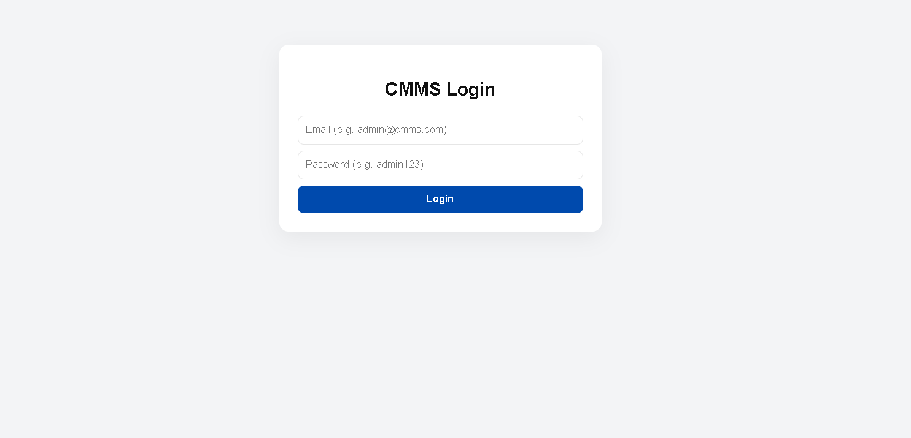
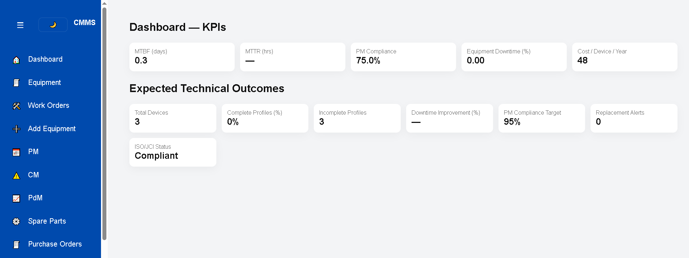
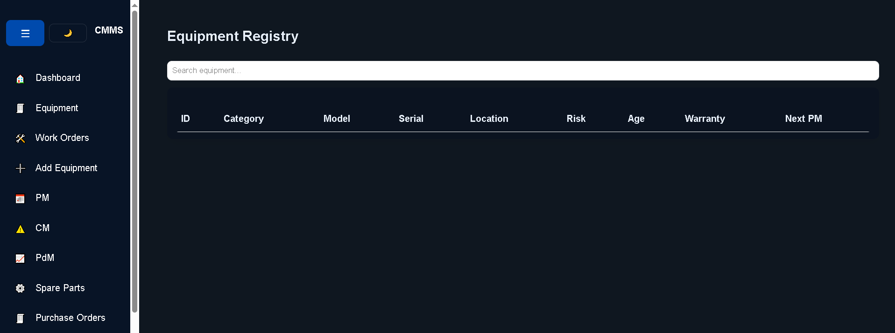
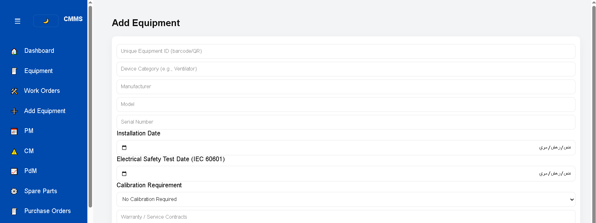

# CMMS - Computerized Maintenance Management System

A professional, standalone web application for managing technical maintenance, medical equipment, and engineering workflows.


#Project overview for some pages






## 🚀 Features

-   **Dynamic Dashboard:** Real-time KPIs (MTBF, MTTR, PM Compliance, and Downtime %).
-   **Asset Registry:** Track equipment by ID, Serial Number, Risk Level, and Location.
-   **Maintenance Management:**
    -   **Preventive (PM):** Scheduled inspections with digital signatures.
    -   **Corrective (CM):** Failure logging using AAMI EQ56 standards.
    -   **Predictive (PdM):** Threshold-based alerts (Vibration/Temperature).
-   **Inventory & POs:** Manage spare parts and automate Purchase Orders.
-   **Interoperability:** Integration endpoints for HL7, DICOM, and HIS systems.
-   **Dark Mode:** Built-in UI toggle for low-light environments.

## 📋 Prerequisites

Since this is a client-side web application, you only need:
-   A modern web browser (Chrome, Firefox, Edge, or Safari).
-   No backend server or database installation is required for the core functionality.

## 📂 Project Structure

```plaintext
├── cmms-project.html    # The main application file (HTML, CSS, and JS)
├── assets/              # (Optional) Folder for images or icons
└── README.md            # Project documentation


